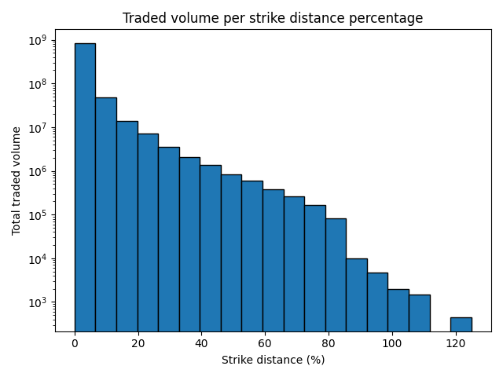
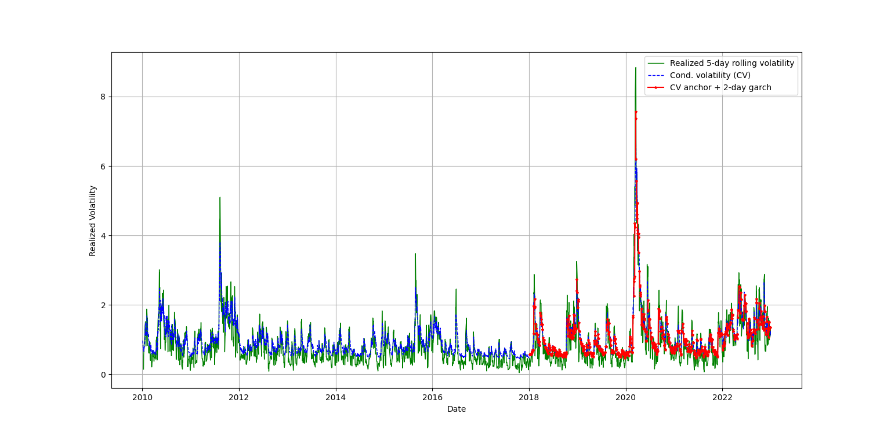
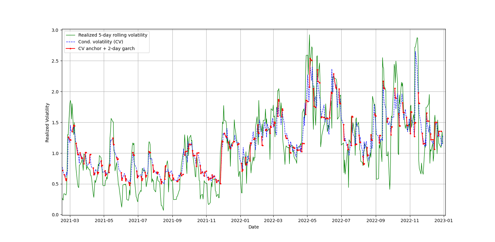
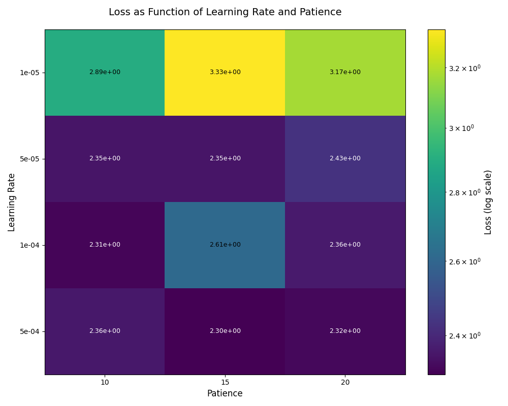
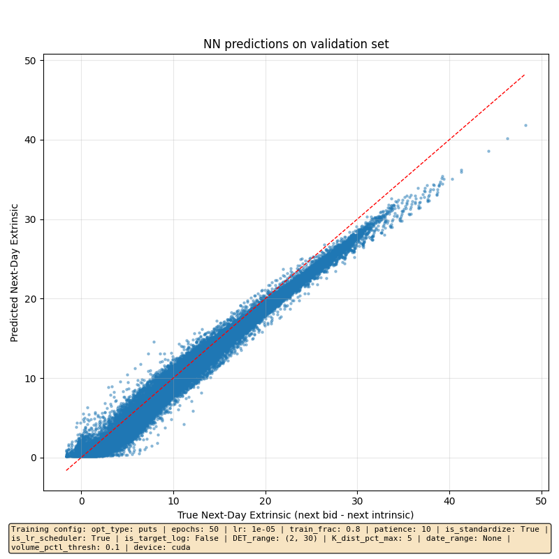
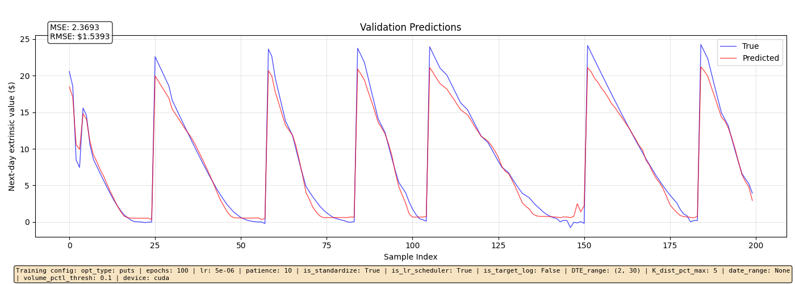

# Backtesting of a Custom ML-Driven Option Trading Strategy

## Motivation
The Black–Scholes framework assumes that if volatility is correctly estimated, a delta-hedged option position should earn the risk-free rate. Many volatility trading strategies are therefore based on forecasting future realized volatility more accurately than the market.

However, option prices are influenced by additional factors beyond volatility expectations. For example, a plausible mechanism is that increased market risk aversion leads to higher option prices. These effects are not captured by volatility-based models alone and may persist systematically.

This project investigates whether a data-driven model can learn such effects and use them to generate alpha.

## Objective & Hypothesis
**Hypothesis.** Option prices embed information beyond their intrinsic value and the realized volatility expected by market participants. A neural network trained on additional variables (e.g. past option price dynamics, bias in volatility forecasting from market participants, risk-aversion indicators) can generate profitable trading signals.

**Goal.** Build and train such a model on historical SPY end-of-day options data, then backtest a 1:1 delta hedging strategy based on its predictions, including transaction costs.

## Data
### Sources
- Historical SPY options end-of-day (EOD) data from Kaggle:
    - 2010–2023: main dataset https://www.kaggle.com/datasets/benjaminbtang/spy-options-2010-2023-eod
    - 2020–2022: secondary dataset for cross-validation https://www.kaggle.com/datasets/kylegraupe/spy-daily-eod-options-quotes-2020-2022

- Underlying SPY prices retrieved via `yfinance` and compared to Kaggle values for consistency.

### Data exploration
Trading activity is strongly concentrated around at-the-money strikes. As strike distance increases, traded volume decreases approximately exponentially (appearing nearly linear on the log-scale), as shown below.


To verify the correctness of the implied volatility computation, I compared the calculated IV (`MY_IV`) against the dataset-provided IV values over random samples:

```
IV (dataset) → IV (computed)
1.32e-01     → 1.31e-01
1.67e-01     → 1.75e-01
1.20e-01     → 1.47e-01
1.33e-01     → 1.40e-01
9.66e-02     → 1.03e-01
...          → ...
```

The custom IV computation shows consistent behavior, with a mean error of **7.01e-03 (5.24%)** and a mean absolute error of **1.07e-02 (7.99%)**, confirming reasonable agreement with the reference data for this sanity check.

To validate the underlying prices, I compared SPY close prices from the options datasets against SPY closes from Yahoo Finance (yfinance) over 2020–2021. The three series overlap almost perfectly, confirming that the underlying data is consistent with market quotes.
**Next steps** quantify variations (e.g. RMSE).

<!--  -->

#### NEXT_QUOTE_DAY Sanity Check

| Metric | Value |
|--------|-------|
| Total days | 2765 |
| Mismatches | 3 |
| Match rate | 99.89% |

**Mismatch Details:**

| Date | Underlying Expects | Options Data Has | Event |
|------|--------------|------------------|--------|
| 2018-12-04 | 2018-12-06 | 2018-12-05 | National Day of Mourning for President George H. W. Bush. |
| 2022-04-14 | 2022-04-18 | 2022-04-15 | Good Friday. |
| 2022-11-23 | 2022-11-25 | 2022-11-24 | Thanksgiving (U.S.). |

**Conclusion:** All 3 mismatches correspond to U.S. market holidays and were skipped (i.e. changed to match underlying dates).

### Filtering criteria:
  - To ensure liquidity: Option volume above the 10th percentile of the sample  
  - To prevent mixing fundamentally different regimes:
    - |STRIKE_DISTANCE_PCT| < 5% 
    - Tried both theta-regime (DTE < 30) and vega-regime (30 < DTE), ended up chosing DTE < 30


## Methodology

### NN Model

#### Output / target
To mitigate the dominant effect of underlying-price fluctuations and focus on more predictable components (which is also more relevant for delta-hedging)
- Next-day extrinsic value of seller-side put option<!-- i.e. (BID - K + S) -->

Target is optionally log-transformed (depending on config)

#### Input features (factors that could affect option pricing by market participants): 
- "EXTRINSIC_BID"
- "STRIKE"
- "UNDERLYING_LAST" # Last traded price of SPY (option's underlying asset)
- "MID"
- "SPREAD"
- "DTE" # Days to expiration
- "GARCH-1", "GARCH-2" # Realized volatility (RV) forecasted by common models e.g. GARCH
- "IV" # BS Implied volatility
- "RF" # Risk-free rate
- "LOG_VOLUME"
- "LOG_MONEYNESS"
- "DELTA", "GAMMA", "VEGA", "THETA", "RHO" # Greeks

##### GARCH forecasting
The sample is split chronologically into:

- **Training:** 2010–2018  
- **Test:** 2018–2022  

Overall GARCH(1,1) fit and realized volatility:



Below is a zoom on the last two years of the test period.  
Red markers show **2-day-ahead GARCH volatility forecasts**, plotted every 5 trading days:



All continuous features are standardized (mean = 0, std = 1).

**Next steps** Add:
- Market sentiment (e.g. quantified via NLP on social media)
- Momentum indicator (e.g. previous return of underlying or MA crossing signal)

Note: since all Black–Scholes inputs are included among the features, the neural network should ideally be able to reproduce the BS pricing function and potentially extend beyond it if additional effects are present.

#### Architecture
Two 64-node layers perceptron with dropouts and normalization layers. 

#### Train / Validation / Test Split

The dataset spans **2010–2022** (2615 trading days) and contains **390,251 datapoints** after filtering, with increasing density in later years:
- $\leq$ 2018: 93,307 (**23.9%**)
- $\leq$ 2019: 143,283 (**36.7%**)
- $\leq$ 2020: 198,209 (**50.8%**)
- $\leq$ 2021: 301,508 (**77.3%**)
- $\leq$ 2022: 390,251 (**100.0%**)

A **3-fold walk-forward expanding-window scheme** is usedto respect time ordering and select hyperparameters that are robust across regimes.
- **Fold 1:**  
  - Train: 2010–2018
  - Validation: 2019
- **Fold 2:**  
  - Train: 2010–2019
  - Validation: 2020
- **Fold 3:**  
  - Train: 2010–2020
  - Validation: 2021

The decision metric (for hyperparameters selection) is the average performance across the three folds. I used ($\mu * \sigma$) as a figure of merit where $\mu$ is the average validation loss and $\sigma$ its std, both weighted by number of datapoints.

Below is an example of grid search performed for hyperparameters tuning:



After tuning, the model is evaluated once on:

- **Test:** 2022

Below scatter plot of the model's prediction (of SPY put options's next-day extrinsinc values) from the whole test set, compared to actual values.



And another visualization of the same data (first 200 values) is shown below:




**Next Steps** Correct title/label of plots (test instead of validation) 

All reported metrics come exclusively from the test period.

### Trading Strategy
Buy 'SPY + PUT' at 't' and sell it at 't+1' when increase of extrinsic value is predicted.

**Demo**
Let us call $S$ the underlying stock price (SPY) and $P$ the put option on it. Assuming no transaction fee (but including spread), the strategy yields return $R$:

$$
R = S_{t+1}^{bid} + P_{t+1}^{bid} - \left( S_{t}^{ask} + P_{t}^{ask} \right)
$$

We split the option price into its intrinsic value $I = K - S$, where $K$ is the strike price, and its extrinsic value $E = P-I$ (i.e. the extra price that some market participants are willing to pay to obtain the option). Unlike standard definitions, I allow negative intrinsic value because exercising an OTM option ($I < 0$) would lose money; the negative value represents this consideration. This allows for a more complete mathematical framework.

This yields $P=K-S+E$, and hence:

$$
R = S_{t+1}^{bid} + K - S_{t+1}^{bid} + E_{t+1}^{bid} - \left( S_{t}^{ask} + K - S_{t}^{ask} + E_{t}^{ask} \right)
$$

$$
R = E_{t+1}^{bid} - E_{t}^{ask}
$$

Hence, for this portfolio, a trading signal is that our prediction of the next extrinsic value $\tilde{E}_{t+1}^{bid}$ be greater than $E_{t}^{ask}$. If accurate, the strategy would be profitable.


## Backtest and Results

#### Conditions / Framework
- Tested on test set (i.e. 2022)
- Spread is accounted for (buy at ask, sell at bid)
- SPY option transaction fee is $0.5
- SPY asset transaction fee is negligible
- Trades are executed when predicted gain is above $0.5 (to lower risk)
- Initial capital is $100,000
- 30% of the capital is blocked to avoid overtrading

## Results
Sharpe ratio $\geq 2.0$

For more information about the metrics, contact me at neillamas@gmail.com

## Conclusions & Future Work
- Upgrade NN architecture to XGBoost or deeper network
- Add more input features such as market sentiment (e.g. VIX)
- Try to detect and isolate market regimes
- EOD data misses intraday microstructure -> Add intraday data to dataset
- Test the model on current data
- Test the strategy with real money by automatizing it (e.g. via Interactive Broker)