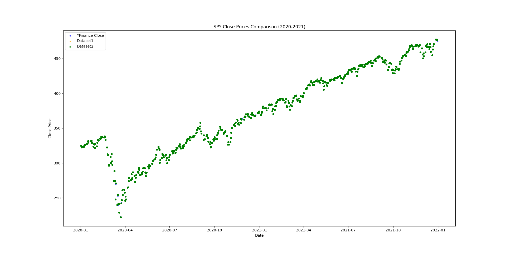

# Backtesting of a Custom ML-Driven Option Trading Strategy

**Status** (Nov 2025): This project is under active development (e.g., extending dataset to 10 years, refining GARCH modeling, building deeper neural network architecture with more input features). Previous versions are available [here](https://github.com/lamasne/technical_analysis.git).

## Motivation
The Black–Scholes framework assumes that if volatility is correctly estimated, a delta-hedged option position should earn the risk-free rate. Many volatility trading strategies are therefore based on forecasting future realized volatility more accurately than the market.

However, option prices are influenced by additional factors beyond volatility expectations. For example, a plausible mechanism is that increased market risk aversion leads to higher option prices. These effects are not captured by volatility-based models alone and may persist systematically.

This project investigates whether a data-driven model can learn such effects and use them to generate alpha.

## Objective & Hypothesis
**Hypothesis.** Option prices embed information beyond its intrinsic value and the realized volatility expected by market participants. A neural network trained on additional variables (e.g. past option price dynamics, bias in volatility forecasting from market participants, risk-aversion indicators) can generate profitable trading signals.

**Goal.** Build and train such a model on historical SPY end-of-day options data, then backtest a simple long/short options strategy based on its predictions, including transaction costs.

## Data
- Historical SPY options end-of-day (EOD) data from Kaggle:
    - 2010–2023: main dataset https://www.kaggle.com/datasets/benjaminbtang/spy-options-2010-2023-eod
    - 2020–2022: secondary dataset for cross-validation https://www.kaggle.com/datasets/kylegraupe/spy-daily-eod-options-quotes-2020-2022

- Underlying SPY prices retrieved via `yfinance` and compared to Kaggle values for consistency.

- Filtering criteria:
    - Option volume above the 5th percentile to ensure liquidity
    - Moneyness (absolute strike distance) below 10%
Notes: Filtering out days to expiration (DTE) > 10 could be intereseting for European options since price must embed expected vol up to maturity (hard to predict --> maybe more random or less activity)
    
## Train / Validation / Test Split

To avoid look-ahead bias, all splits are chronological.

### Walk-Forward Validation (3 Folds)
A rolling expanding-window scheme is used for hyperparameter tuning:

- **Fold 1:**  
  - Train: 2010–2017
  - Validation: 2018

- **Fold 2:**  
  - Train: 2010–2018  
  - Validation: 2019

- **Fold 3:**  
  - Train: 2010–2019
  - Validation: 2020

Hyperparameters are selected by averaging validation performance across the three folds.  
No shuffling is applied at any stage.

### Final Evaluation
After tuning, the model is retrained on **2010–2020** and evaluated once on:

- **Test:** 2021–2023

All reported metrics come exclusively from the test period.


## Methodology

### Model
Supervised neural network predicting next-day option mid-price change. 
To mitigate the dominant effect of underlying-price fluctuations and focus on more predictable components, I trained a second model on next-day bid minus intrinsic value, which is also more relevant for delta-hedging.

**Output**
- Predicted next-day option mid-price change

**Example input features** (factors that could affect option pricing by market participants): 
- Implied volatility (IV)
- Realized volatility (RV) forecasted by common models e.g. GARCH
- Option mid-price
- Price of underlying asset
- Strike price and moneyness
- Days to expiration
- Risk-free rate
- Greeks (e.g. Delta)
- Volume / liquidity indicators
- Market sentiment (e.g. quantified via NLP on social media)

Note: since all Black–Scholes inputs are included among the features, the neural network should be able to reproduce the BS pricing function and potentially extend beyond it if additional effects are present.

### Trading Strategy
To isolate the effect of the model, a simple directional strategy is used:

```
signal = NN prediction of (next-day option price – current price)

if signal > threshold → buy option
if signal < -threshold → sell option
```

Transaction costs are incorporated in the backtest.

## Backtest Framework
To be defined:
- Execution assumptions (EOD pricing, slippage model)
- Performance metrics (Sharpe ratio, annualized return, drawdown, hit ratio)

## Results

### Data exploration
Trading activity is strongly concentrated around at-the-money strikes. As strike distance increases, traded volume decreases approximately exponentially (appearing nearly linear on the log-scale), as shown below.


To verify the correctness of the implied volatility computation, I compared the calculated IV (`MY_IV`) against the dataset-provided IV values over random samples:

```
IV (dataset) → IV (computed)
1.32e-01     → 1.31e-01
1.67e-01     → 1.75e-01
1.20e-01     → 1.47e-01
1.33e-01     → 1.40e-01
9.66e-02     → 1.03e-01
...          → ...
```

The custom IV computation shows consistent behavior, with a mean error of **7.01e-03 (5.24%)** and a mean absolute error of **1.07e-02 (7.99%)**, confirming reasonable agreement with the reference data for this sanity check.

To validate the underlying prices, I compared SPY close prices from the options datasets against SPY closes from Yahoo Finance (yfinance) over 2020–2021. The three series overlap almost perfectly, confirming that the underlying data is consistent with market quotes.




### Model

## GARCH forecasting
The sample is split chronologically into:

- **Training:** 2010–2018  
- **Test:** 2018–2022  

Overall GARCH(1,1) fit and realized volatility:


Below is a zoom on the last two years of the test period.  
Red markers show **2-day-ahead GARCH volatility forecasts**, plotted every 5 trading days:


### Backtest
**To be completed upon backtest execution.**

## Conclusions & Future Work
**To be completed upon backtest execution.**


